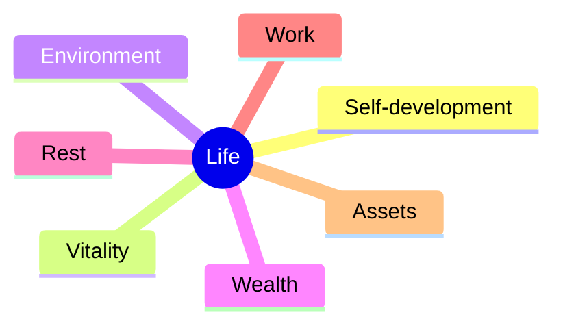

# Personal OS — Home

> Vault entry point. Scaffolder-generated skeleton — fill the sections as the vault grows.
> Quick links: [CLAUDE.md](CLAUDE.md) · [MEMORY.md](MEMORY.md) · [context/](context/) · [daily/](daily/)

> _North star (from your profile):_ _{{from north_star}}_

## Balance overview

_Scores get written in by the scaffolder from `svoboda_scores` after a profile run._

---

## Projects

_Active pieces of work. Link each to its file under `knowledge/projects/` or its
`projects/{name}/` context once created._

| Project | Status | Pointer |
|---------|--------|---------|
| _—_ | _—_ | _—_ |

---

## Knowledge

_Map of the knowledge graph. Link the top-level MOCs here as they appear._

- People → `knowledge/people/`
- Concepts → `knowledge/concepts/`
- Tools → `knowledge/tools/`
- Maps of Content → `knowledge/moc/`

---

## System

_Health and operational state of the OS itself._

- State → [state/current.md](state/current.md)
- Rules → [context/anti-patterns.md](context/anti-patterns.md)
- Quality bar → [context/scoring-gate.md](context/scoring-gate.md)
- Skills → `.claude/skills/`
- Templates → `_templates/`

---

## Daily

_Today's note: `daily/YYYY-MM-DD.md`. Recent reports: `reports/`._
