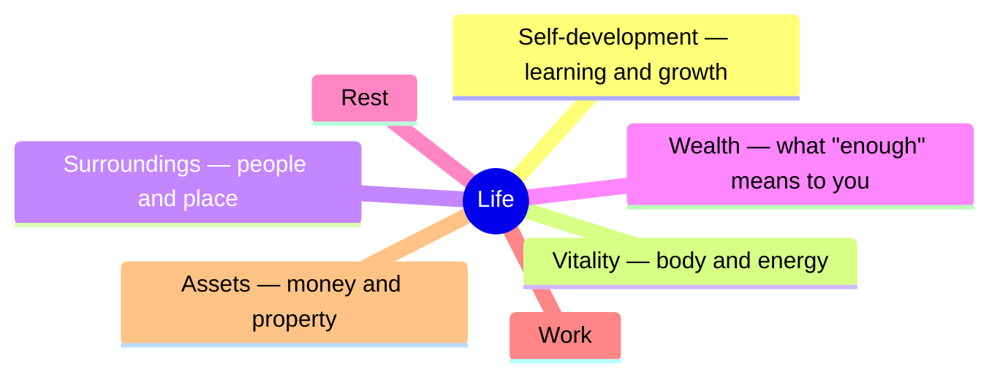

# Home

> **This page is still empty.** The assistant fills it in once you have been through onboarding —
> type `/start`.
> Nearby: [CLAUDE.md](CLAUDE.md) · [MEMORY.md](MEMORY.md) · [context/](context/) · [daily/](daily/)

> _The main thing you are heading towards:_ _{{from north_star}}_

## The seven areas of life

_The assistant sets the number for an area itself — and only once you have told it enough.
While there is little to go on, it says so instead of giving a number: "you didn't talk about
this"._

---

## Things you're doing

_What you are busy with now. Each line points to a file in `knowledge/projects/` or to a folder
`projects/{name}/` once one exists._

| Thing | How it's going | Where it lives |
|------|----------|-----------|
| _—_ | _—_ | _—_ |

---

## Notes

_What you have already told me, sorted onto shelves._

- People → `knowledge/people/`
- Concepts → `knowledge/concepts/`
- Tools → `knowledge/tools/`
- Overview pages → `knowledge/moc/`

---

## How to use me

_Just talk. Four words, if you want them — type them with the slash:_

- `/session-save` — save this conversation into memory
- `/recall` — find an old note
- `/reflect` — go over my misses of the last few days
- `/start` — only to redo the first session

_Every few days I will offer to tidy my memory and, separately, to go over my misses — you only say yes. Everything else in plain words. How each word works, with examples, and what is inside this folder: [docs/en/guide.md](docs/en/guide.md)._

---

## Housekeeping

- Where we stopped → [state/current.md](state/current.md)
- What the assistant must not repeat → [context/anti-patterns.md](context/anti-patterns.md)
- What the assistant can do → `.claude/skills/`
- Blank forms for new notes → `_templates/`

---

## Days

_Today's note: `daily/YYYY-MM-DD.md`. Everything the assistant put together as a separate file:
`reports/`._
