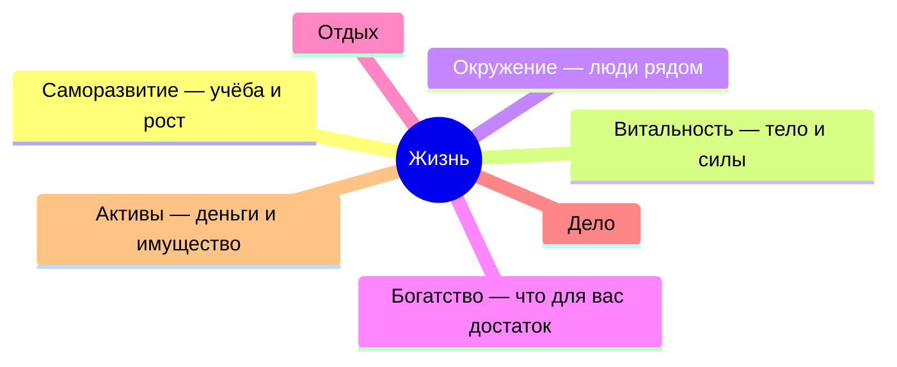

# Главная

> **Страница пока пустая.** Помощник заполнит её, когда вы пройдёте знакомство — напишите ему `/start`.
> Рядом: [CLAUDE.md](CLAUDE.md) · [MEMORY.md](MEMORY.md) · [context/](context/) · [daily/](daily/)

> _Главное, к чему вы идёте:_ _{{from north_star}}_

## Семь сфер жизни

_Цифру по сфере помощник ставит сам — и только когда вы рассказали достаточно.
Пока рассказов мало, вместо цифры так и написано: «об этом не говорили»._

---

## Дела

_Чем вы заняты сейчас. Каждая строка ссылается на файл в `knowledge/projects/`
или на папку `projects/{название}/`, когда она появится._

| Дело | Как идёт | Где лежит |
|------|----------|-----------|
| _—_ | _—_ | _—_ |

---

## Записи

_Что вы уже рассказали, разложенное по полкам._

- Люди → `knowledge/people/`
- Понятия → `knowledge/concepts/`
- Инструменты → `knowledge/tools/`
- Сводные страницы → `knowledge/moc/`

---

## Служебное

- На чём остановились → [state/current.md](state/current.md)
- Что помощнику не повторять → [context/anti-patterns.md](context/anti-patterns.md)
- Что помощник умеет → `.claude/skills/`
- Бланки для новых записей → `_templates/`

---

## Дни

_Сегодняшняя запись: `daily/ГГГГ-ММ-ДД.md`. Всё, что помощник собрал отдельным файлом: `reports/`._
