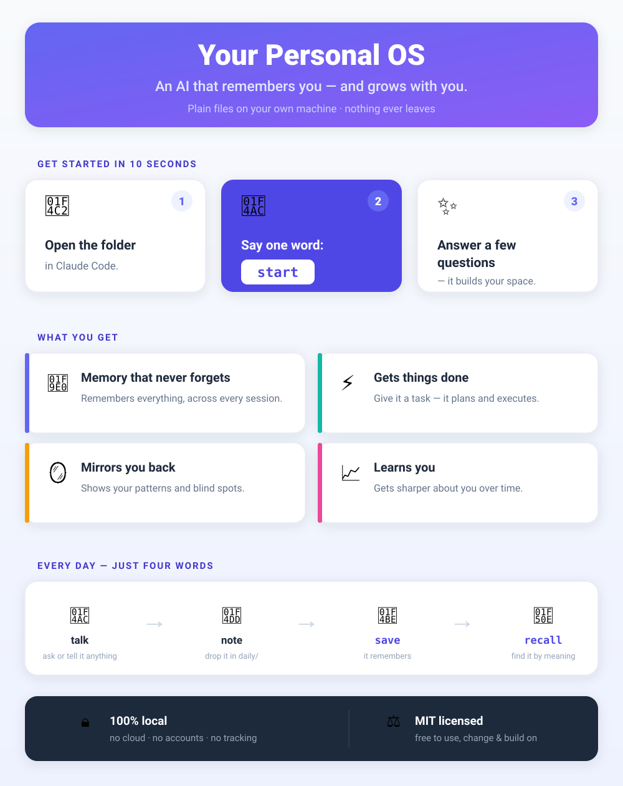

# Personal OS — a memory for Claude Code

**Your AI forgets everything the moment you close it.** Every session you re-explain who you are, what you're building, and what you already decided last time.

This fixes that. It's a folder of plain text files that gives [Claude Code](https://docs.claude.com/en/docs/claude-code) a lasting memory — of **you**, your projects, your decisions, and the mistakes you told it not to repeat. It grows as you use it, and it all lives on your machine as Markdown you can read, edit, and back up. No database, no cloud, nothing leaves your computer.

You don't configure anything. You open the folder and say **`start`** — it interviews you for a bit and builds your personal setup *with* you. It ships **blank**; nothing here is anyone else's data.

## What you actually get

- 🧠 **Remembers you across every session** — stop re-introducing yourself and your goals each time.
- 📂 **Tracks your projects and decisions** — pick up exactly where you left off, days or weeks later.
- 🪞 **Learns your preferences and stops repeating corrected mistakes** — it keeps a running list and checks it.
- 🔎 **Finds anything you've ever told it by meaning**, not just keywords (optional, runs a small model fully offline).
- 📝 **Everything is plain Markdown in a git folder you own** — read it, grep it, diff it, back it up, take it anywhere.

Think of it as a second brain for your AI: **memory** (it knows you) + **execution** (it tracks the work) + **mirror** (it reflects your patterns back and improves).

## ▶ Launch in 10 seconds

One word runs the whole setup — no commands, no steps to remember.

- **Already have this folder open in Claude Code?** → just type: **`start`**
- **Starting from the repo link?** → in Claude Code, say: *"Clone `<your-repo-url>`, open it, and run start"*

That's it. `start` greets you, asks a few questions, and builds your personalized space with you — you just talk.

> 📖 **New here? The [1-page guide](GUIDE.md) tells you everything in plain language.**

## How it works



<sub>Want the architecture deep-dive? See the poster in [`docs/architecture.png`](docs/architecture.png) or open [`docs/architecture.html`](docs/architecture.html) in a browser.</sub>

## Quickstart

**1. Open this folder in Claude Code.**
```
cd pos-starter
claude
```

**2. Say `start`.** That's the whole quickstart. `start` runs the setup with you end-to-end: it gets to know you (a guided self-portrait — life state, drivers, balance wheel, friction points), then builds your living vault (`context/root.md` identity anchor, `context/identity.md`, starter goals, anti-patterns, knowledge-graph skeleton), and turns on semantic memory. From here it's yours — talk to it, dump notes into `daily/`, grow `knowledge/`.

<details><summary><b>Prefer to drive it manually?</b> (what <code>start</code> does under the hood)</summary>

`start` just orchestrates these skills so you never type them. You can run them yourself:
```
/svoboda-profiler <yourname>   # guided self-portrait → writes profile.yaml
/vault-scaffolder <yourname>   # turns profile.yaml into your personalized vault
```

**Semantic memory** — `/recall` finds notes by *meaning*, not just keywords. `start` sets this up for you; to do it by hand it's a one-time local setup (Python + a ~309 MB model, downloaded once, then fully offline):
```
bash scripts/memory_index_setup.sh                       # venv (~1 GB: numpy, onnxruntime, transformers)
.memory_venv/bin/python scripts/memory_index.py build    # embeds your vault → state/memory-index/
```
Skip it and everything still works — the graph falls back to `grep`, and the recall hook stays silent until you build the index.

</details>

## What's inside
- `CLAUDE.md` / `AGENTS.md` — boot rules (operating rules, orchestration, memory map).
- `context/` — rules, goals, lessons, anti-patterns, and `workflow-doctrine.md` (how/when to orchestrate multi-agent workflows). Filled/personalized by the scaffold.
- `knowledge/` — your knowledge graph: one Markdown file per entity, linked with `[[wikilinks]]`.
- `state/` · `daily/` · `reports/` — cross-context state, daily notes, generated artifacts.
- `memory/` — long-term memory store and session saves.

## Optional modules
A **module** is an extra skill you plug into the engine. The engine ships with **no modules of its own** — only one worked example (`modules/example-skill/`), off by default.

To see the mechanism: flip `enabled: true` for `example-skill` in `modules.yaml`, then run `/enable-modules` — it creates the declared directories and copies the seed files (it never overwrites your data). Do not copy module folders manually.

To make your own: copy `modules/example-skill/` to `modules/<yourname>/`, edit its `SKILL.md`, add a matching stanza in `modules.yaml`, and enable it. That one example is the template, the test, and the how-to in a single folder.

## Notes
- **Time:** the profiling interview is deep — budget ~90–120 min. Do it across as many sittings as you like: stop after any domain, then say `start` again to pick up where you left off (it resumes, never restarts).
- **Run it in your own copy** of this folder — `/vault-scaffolder` overwrites `CLAUDE.md` and fills the context files, so don't point it at a workspace you care about for anything else.
- **`<yourname>` is a slug:** lowercase + hyphens, no spaces — `/svoboda-profiler marcus-reyes`.
- **Platform:** needs a POSIX shell (macOS, Linux, or Windows + WSL2/Git Bash) — the same requirement as Claude Code itself.
- **Dependencies (two tiers):**
  - **Core** — pure Markdown: profiler, scaffolder, knowledge graph, daily notes, `/dream`, `/reflect`, `/session-*`. Needs only Claude Code + a POSIX shell + `python3` (stdlib only, for the wikilink-lint hook). Nothing to install.
  - **Optional semantic memory** (`/recall` + the grep-augmenting hook + `/dream` index update): needs `python3` + `pip`, then `bash scripts/memory_index_setup.sh` (a ~1 GB venv: numpy / onnxruntime / transformers / huggingface_hub / sentencepiece) and one `memory_index.py build` that downloads a ~309 MB local model from HuggingFace (internet required once; no API key). It **fails open** — until you build it, `/recall` and the hook just no-op and the core keeps working.
  - `/ingest` YouTube path also needs `yt-dlp` (`brew install yt-dlp` or `pip install yt-dlp`).
- **Not using Claude Code?** Skills are plain Markdown — tell your agent: *"read `.claude/skills/<name>/SKILL.md` and follow it"* (start with `start` — it orchestrates the rest). See `AGENTS.md` + `context/agent-runtime.md`.

## Privacy
This repo ships blank — **your data stays on your machine.** Files are local Markdown; there's no telemetry and no external sync unless you set one up yourself.

## License
The **engine** (boot logic, skills, rules, templates, docs) is **MIT-licensed** — see [`LICENSE`](LICENSE). Use it, change it, ship it, build on it freely; just keep the copyright notice.

Your own content on top of the engine (your `profile.yaml`, identity, knowledge graph, daily notes, memories) is **yours** — the license doesn't touch it.

Copyright (c) 2026 xcota.
