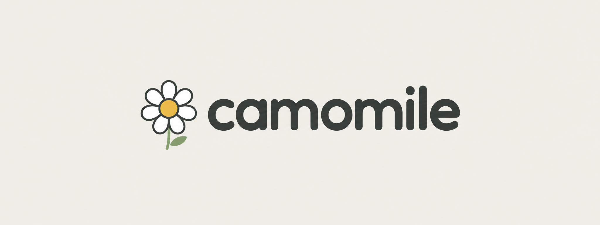

中文 · [English](README.md) · [Русский](docs/ru/README.md)

# Camomile（洋甘菊）

**在线介绍页：** https://xcota.github.io/pos/ （中文 · English · Русский）

**你电脑里的一个文件夹。在这里，AI 助手记得你：你在忙什么、你做过什么决定、该用什么方式跟你说话。**

平常的 AI 聊天，窗口一关就全忘了。每次都得从头讲：你是谁、在做什么、上回说好了什么。在这里，助手把这些写成文件，存在你自己的硬盘上，每次开始聊天先读一遍。

**给谁用。** 给听说过 ChatGPT、又想让 AI 多帮点忙的人。不用写一行代码。

**先说清楚三件事，免得你白忙：** 只能在 Mac 或者 Linux 电脑上用，Windows 现在还不行；还要有 Claude（一个 AI 聊天工具，跟 ChatGPT 差不多）的付费账号；而且 Claude 账号在中国内地和港澳注册不了、也付不了钱——Anthropic 公布的可用国家和地区名单里没有这几个地方（名单见 https://www.anthropic.com/supported-countries ），你得能连到名单里那些地区的网络，付费也要用那边的银行卡。这是 Anthropic 那边的规定，跟这个文件夹没关系，我们也改不了。

## 你会得到什么

- **不用一遍遍介绍自己。** 打开对话，助手已经知道你在忙什么、上周二定了什么、为什么这么定。
- **事情不会丢。** 一件事放下很久，回来问一句“我上次做到哪了”，有答案，连当初为什么搁下也写着。
- **旧决定找得回来。** “我把不租那套房的原因记在哪了？”——就算你当时用的是别的说法，也能找到。这是**按意思搜索**（不用一模一样的词也能找到）。刚认识的时候，助手会用一个“要不要”的问题问你装不装，并老实告诉你它占多少地方、要花多长时间。你说不装，就改成按原词搜索，那样换个说法就找不到了。
- **你定的说话规矩会留下来。** “别写这么长”、“别一次问两个问题”、“叫我名字就行”——这些会记进“我是谁”这个文件里的“怎么跟我打交道”那一段，而这个文件助手每次启动都会重读。你在对话结尾说“存一下”的时候，他会把一两条备选的句子摆出来，只写你点头的那几条。
- **不用给自己打分。** 没有人要你给“健康”或者“钱”打几分。你像跟朋友聊天一样讲，剩下的他自己理，理完拿给你看。
- **一眼能看到日子整体过得怎么样。** 七个方面：自我成长（学习与成长）、活力（身体与精力）、环境（身边的人和住的地方）、财富（对你来说什么是够）、休息（什么让你恢复）、事业（你在做什么）、资产（钱和财产）。每个方面有一张卡片：你讲过什么、哪些你根本没提，都看得见。你在对话结尾说“存一下”，这次聊出来的新东西就会添一两行进对应的卡片。

## 你需要准备什么

- **一台 Mac 或者 Linux 电脑。** Windows 目前用不了——还没有做 Windows 的版本，别白花一晚上。
- **Claude Code 这个程序，加上 Claude 的付费订阅**（Anthropic 的 Pro 或 Max 两档，Anthropic 就是做 Claude 的那家美国公司）。Claude Code 是 Anthropic 做的另一个程序：你在终端（输入命令的窗口）里把它打开，然后就在这个窗口里跟助手聊天，跟平常的聊天一样。助手住在这个程序里，不在这个文件夹里。订阅的钱付给 Anthropic，这是这里唯一要花的钱。
- **两个后台小程序，都免费：Python 和 Git。** 第一个是助手用来在你的记录里搜东西、还有核对自己引用的话；第二个是用来保存你记录的旧版本。Mac 上通常本来就有。没有 Python 也不会坏，屏幕上不会跳错误，只是没有按意思搜索、也不核对引用；助手会用大白话告诉你，并说该装什么。
- **这个文件夹**，下载下来解开，放在你顺手的地方。
- **大概十五分钟**做第一次，还有聊天全程要联网。

## 怎么开始：四步

1. **装 Claude Code。** Anthropic 的说明在这里：https://code.claude.com/docs/en/setup ——上面有一行命令（就是一行字，打给电脑让它去做事），把它复制、粘到终端里，再按回车。Mac 上这个窗口叫“终端”，这么打开它：按住 Command（⌘）再按一下空格，屏幕中间会冒出一个搜索框，打“终端”两个字，回车。只用装一次。要有已经付费的 Claude 订阅，Pro 或 Max 都行。
2. **下载文件夹。** 打开 https://gitee.com/cotya/pos-starter ，点“克隆/下载”，选“下载 ZIP”。也可以从 https://github.com/xcota/pos 下（绿色的“Code”按钮 →“Download ZIP”），不过在国内 GitHub 常常打不开。下下来的是一个压缩包（ZIP 文件），双击就会在旁边解出一个文件夹（名字是 `pos-starter-master` 或者 `pos-main`）——把它挪到“文稿”里（Mac 上默认放文件的那个文件夹）；想改名叫 Camomile 也行，改了不会坏。
3. **在 Claude Code 里打开这个文件夹。** 还是那个终端窗口（关了就照上面的办法再开一次），先打 `cd`，空一格，然后用鼠标把文件夹直接拖进窗口，回车。`cd` 的意思是“进到某个文件夹”：你在告诉这个窗口，接下来跟哪个文件夹打交道。拖进去之后，那一行会自己出现一长串带斜杠的字——那是文件夹的地址，本来就该这样，不用改。然后打 `claude`，回车。要是回你一句 `command not found`，说明程序没装上，回到第 1 步。
4. **打 `/start`。** 就打在刚出现的那行可以打字的地方，用英文字母，前面那条斜杠也要打，然后回车。后面由助手带着走：他问你，你答，你的文件夹他自己搭。中间随时可以停——回来再打一次 `/start`，从停下的地方接着走，不用重来。

**怎么知道成功了。** 打完 `claude`，窗口会清空，出现程序的问候语，下面有一行可以打字的地方。这就算成了：接下来全在这里发生，就是普通的一来一回——你打一句话，回车，看他回什么。除了下面小抄里的那几个词，别的命令一个都不用记。

## 第一次见面是怎么走的

先说清楚，免得你觉得意外：

- 助手问你想让他怎么称呼你，再用一段话讲清楚接下来会发生什么。
- 一个“要不要”的问题：装不装按意思搜索。
- **三段讲述，不是问卷**：昨天一天，从起床到睡觉；这一个月——买了什么、后悔什么、高兴什么；这一年学到了什么、跟谁学的。一次都不会让你给自己打分。
- **每个方面给你一张卡片过目**：带编号的几行，「你说」（只有你原话）、「我在你的文件里看到」、「我觉得」，再加上「我不知道」和「我听到的是『…』——对吗？」。你按编号改：“第 3 条不对，其实是……”。
- **每个方面的分数**只出现在卡片最后一行，而且只在你这个方面讲得够多的时候才有。分是助手打的，旁边写着他有多大把握。讲得少就干脆没有分：“这个你没说过”。
- 至少有两张卡片你看过、点头或者改过，他才开始搭你的文件夹。
- 最后他会请你关掉他、在同一个文件夹里重新打开一次。就是第 3 步那两行。整个见面过程要动手的只有这一次。

想细看：[这是什么、怎么运作](docs/zh/presentation.md) · [见面的完整流程](docs/zh/onboarding-flow.md)

## 明天怎么回来

还是那个窗口、那两行：先 `cd` 加上你的文件夹，再 `claude`。在终端里按键盘上的向上箭头，会把你上次打的字调出来，这样更快。

## 你的东西存在哪

全在你自己的硬盘上，是普通的文本文件，记事本都打得开。没有另外的存储程序，也没有我们的服务器。我们不给你注册任何东西：我们这边没有账号，也没地方注册。要订阅的只有 Anthropic 那边，为的是 Claude Code 这个程序。文件夹一拷贝，你的记录就整个搬走了；文件夹一删，记录就没了。

密码、密钥、银行卡号不用给助手，就算你在聊天里说出来，他也不会写进你的文件——这写在他的规矩里。

关于硬盘地方：如果你同意了按意思搜索，会在文件夹之外、系统的一个角落里留下它用的词典，大概一个 G。那不是你的记录，但确实占地方；要清掉，助手会告诉你怎么清。

关于联网，有句实话要说在前面：助手要回你话，你记录里的片段就会发到 Claude 那边——跟你在任何 AI 聊天里发的文字一样。东西存在你这里，脑子转在 Anthropic 的服务器上。所以要联网。

## 小抄：三个词

用英文字母打，前面带斜杠，直接打在聊天那一行里：

| 词 | 有什么用 |
|---|---|
| `/session-save` | 把这次对话存进记忆 |
| `/recall` | 找出以前的记录 |
| `/reflect` | 复盘这几天出的岔子 |

`/start` 只在最开头用一次（还有就是接着没走完的见面流程）。上面这些用大白话说也行：“把这次对话存一下”、“找找我在哪写过……”。

## 许可

AGPL v3：自己用、自己改，都免费；如果你拿它做成一个服务给别人用，那你改的部分也要公开。全文在 LICENSE 文件里。
